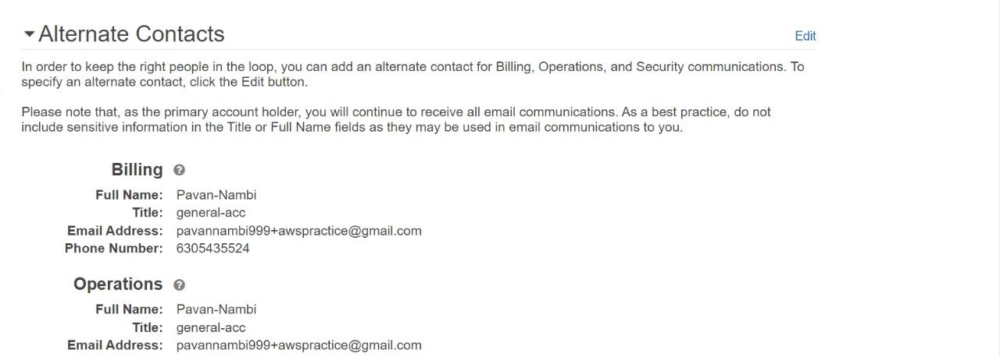
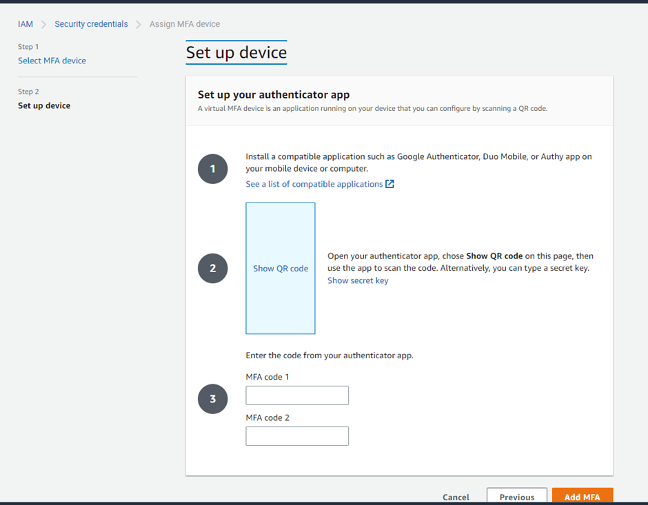
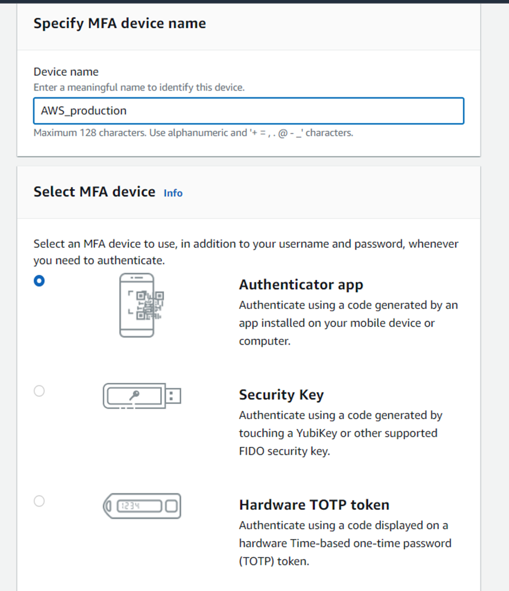
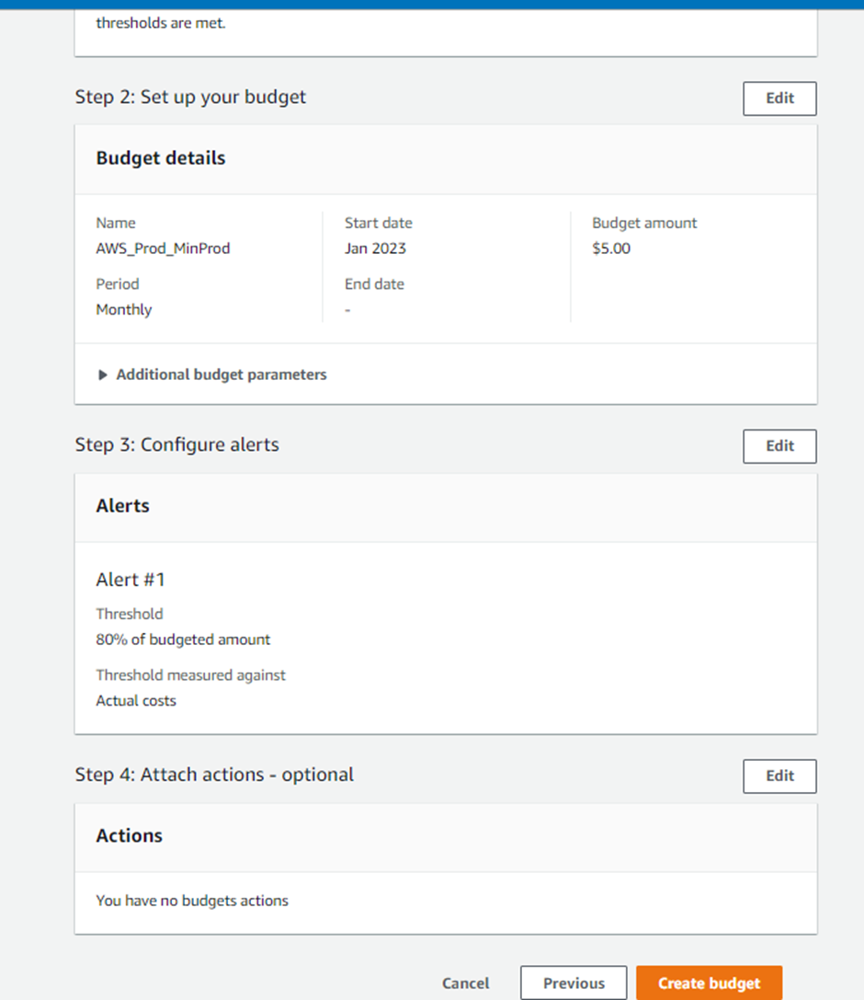

# Steps_for_AWS_Account_Creation

<!--  -->

## :pushpin: Creation Process

Click on the Create AWS Account.

Mention the Root User Email Address (use the acc_nm+…. @gmail.com trick to get a unique account under the same email id).

Give a unique AWS Account Name.

Verify the email

You will receive and email verification from Amazon.

Verify the Code send on your email.

Now give a strong password for the Root User Account and move to the next step.

Select the Plan for AWS Personal- for your own projects, provide your Full Name and Phone Number, Address, City State, Postal Code and agree the terms and conditions and move on next.

Now comes Billing Information enter all the billing details and click next.

If there are no errors in the Billing stage you will move on the next stage.

Confirm your Identity step enter number to verify yourself and enter the captcha.

Select the support Plan – Basic Support – Free plan and click Complete Sign up

Account get created successfully.

Click on AWS Management Console button.

Note: you can use same debit card/credit card info for as many accs as u want to make  
Sign in Process

## :pushpin: Sign In Process

1. Now Sign in to the previous created acc.
2. After Signing in make sure that the Location as N.Virginia East
3. Click on the Profile and in the drop-down select Account and find I AM User and Role
4. Access to Billing Information.
5. Go to Accounts and Edit Alternate Contacts and click on Update
   <!-- !image -->

   

6. On same page Click Edit and Activate IAM Access and click on Update.
7. Now in-order to activate MFA for this account. Go to Profile select Security credentials.
8. Now Click on Assign MFA
   

9. Select an Authenticator App for authentication
   
10. Scan the QR Code from the Authenticator and enter 2 MFA's back to back from the app into the text boxes and click on Add MFA.
    
11. Go to accounts then Billing Dashboard initially you won see anything
12. Select Budget from the Sidebar and Create a Budget for your account.
you can go with either zero based template one or customize below ss refers to customized version.

Here u have to click enable cost explorer and enable. It will say wait for 24 hr to get all data but u can just revisit this page and continue…
<!-- image-->
13. After setting up the Budget Configure Alerts in there click on Add an Alert Thershold.
<!-- image-->

14. An Alert Threshold
<!-- image-->

15. Added Alter Threshold
<!-- image-->

16. Review the Budget once and click on Create Budget.
<!-- image-->

17. Successful creation of Budget.
<!-- image-->

18. Select Billing Preference’s
<!-- image-->
